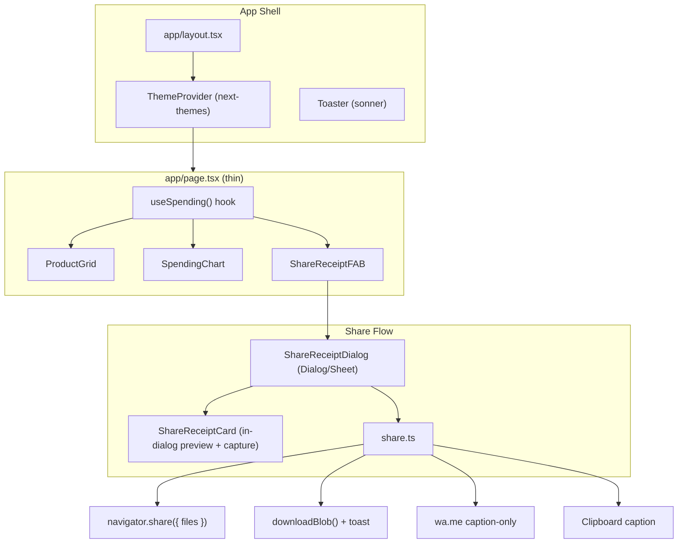
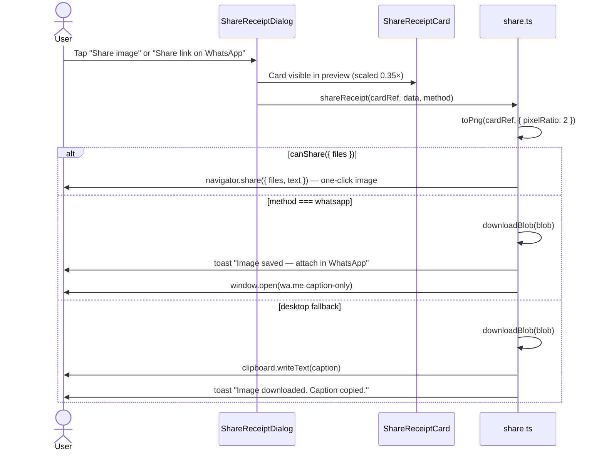

# Spend The Gambia's Money — UI Polish & Share Receipt Design

| Field | Value |
|-------|-------|
| **Author** | TBD |
| **Date** | 2026-07-06 |
| **Status** | Draft (rev 5 — user decisions) |
| **Workspace** | `C:\Users\hp\Documents\personal projects\spend-gambia-money` |

---

## Overview

This document specifies a full UI/UX overhaul of **Spend The Gambia's Money**, a Next.js 15 client-side GDP spending simulator. The app currently works functionally (`app/page.tsx` buy/sell logic, `Header.tsx` balance display, Recharts pie chart) but presents a generic dark-slate gradient aesthetic that reads as "vibe-coded." Components ignore the light/dark CSS variables in `app/globals.css` and hardcode `bg-slate-900` throughout.

The proposed solution introduces **shadcn/ui** as the default component system, a **system-first theme** via `next-themes`, a **distinctive Gambian editorial visual language** (flag-accented, not gradient-heavy), and a **shareable receipt card** exportable via native share sheet, WhatsApp (platform-dependent), download PNG, or copy text. The monolithic `app/page.tsx` (~216 lines) will be decomposed into focused components and a custom hook while preserving all existing game behavior.

**Share UX honesty:** True one-click **image + caption** sharing is only available where `navigator.share({ files })` is supported (most mobile browsers). WhatsApp `wa.me` deep links are **caption-only** — they cannot programmatically attach images. The design documents per-platform behavior and labels buttons accordingly.

---

## Background & Motivation

### Current State

| Area | Current Implementation | Pain Point |
|------|------------------------|------------|
| **UI library** | Raw `<button>`, inline Tailwind | No design system, inconsistent states |
| **Theming** | `globals.css` has `--background`/`--foreground` + `prefers-color-scheme`, but `page.tsx` and `Header.tsx` override with `bg-slate-900 text-white` | Light mode unusable; no user override |
| **Typography** | `layout.tsx` loads Geist via `next/font`, but `globals.css:25` sets `font-family: Arial, Helvetica, sans-serif` on `body` | Geist never renders |
| **Layout** | 3-column product grid, sticky header, conditional chart | Functional but visually generic |
| **Sharing** | Metadata in `layout.tsx` promises "invoice downloads, and social sharing"; `backups.tsx` has commented invoice modal + stub `shareInvoice`/`downloadInvoice` | Feature gap vs. marketing copy |
| **Social previews** | OpenGraph uses `/og-image.jpeg` (exists); Twitter card uses `/og-image.jpg` (`layout.tsx:45`) — **file does not exist** | Broken Twitter/X link previews today |
| **State** | `history` state in `page.tsx` is written on every buy/sell but never rendered | Dead code |
| **Data** | `app/lib/products.ts` has **duplicate `id: 17`** (School Fees + Bitcoin); duplicate `emoji: "⚽"` on ids 6 and 18 | React key collision risk |

### Why Now

- SEO/OG metadata already advertises sharing — implementing it closes a trust gap.
- `lucide-react` is already a dependency (used in commented `backups.tsx`); shadcn aligns with existing stack.
- Tailwind CSS v4 + Next.js 15 App Router is supported by current shadcn CLI (`npx shadcn@latest init`).

---

## Goals & Non-Goals

### Goals

1. **shadcn/ui as default** — all interactive UI via `components/ui/*` primitives.
2. **System-first theming** — default to OS preference; manual light/dark toggle persisted in `localStorage`.
3. **Distinctive, professional design** — editorial layout inspired by Gambian identity, not generic AI dark gradients.
4. **Shareable receipt card** — platform-appropriate share: native image share where supported; honest fallbacks elsewhere.
5. **Component architecture** — extract state, grid, chart, header, receipt into testable units.
6. **Accessibility** — keyboard-navigable controls, screen-reader-accessible chart data (visually hidden table fallback), focus rings from shadcn.

### Non-Goals

- Backend, auth, persistence of purchases across sessions (remain ephemeral client state).
- Real PDF generation server-side (PNG receipt is sufficient for social sharing).
- Product catalog CMS or admin panel.
- i18n / Wolof localization (English only for this phase).
- Replacing Recharts (keep; add accessible data table alongside chart).
- Fixing product pricing accuracy against real GDP data (out of scope).

---

## Proposed Design

### High-Level Architecture



### Visual Design Direction: "Gambian Ledger"

**Avoid (current vibe-coded patterns):**
- `bg-gradient-to-br from-slate-800/90 to-slate-900/90` on every surface
- Orange/emerald neon accents on all CTAs
- `animate-pulse` on the flag in `Header.tsx`
- Full-bleed dark shell with no typographic hierarchy

**Adopt:**
- **Base palette:** shadcn `zinc` neutral scale for backgrounds/borders — clean, not purple-tinted slate.
- **Accent palette (Gambia flag, used sparingly):**
  - Crimson `#CE1126` → `--gambia-red` (primary CTA, progress spent portion)
  - Cobalt `#0C1C8C` → `--gambia-blue` (links, chart accent)
  - Forest `#3A7728` → `--gambia-green` (positive balance, buy actions)
- **Typography:** Geist Sans via `next/font` — **remove Arial override** in `globals.css` (verified bug at line 25); use `font-mono` (Geist Mono) only for currency figures.
- **Layout:** Max-width `7xl`, generous `gap-6`, product cards with fixed aspect-ratio images (`aspect-[4/3]`), no `h-80` rigid height.
- **Surfaces:** Flat `Card` with subtle `border` and `shadow-sm` — no glassmorphism.
- **Background:** Light mode — warm off-white `#FAFAF8`; dark mode — `zinc-950` with optional subtle river pattern (see PR 6, non-blocking).
- **Motion:** `transition-colors` only; remove `animate-pulse` on flag; optional `motion-safe:scale-[0.98]` on button press via Tailwind.

### shadcn/ui Setup (Tailwind v4 + Next.js 15)

#### Initialization

```bash
npx shadcn@latest init
```

Recommended `components.json` options:

| Option | Value | Rationale |
|--------|-------|-----------|
| Style | `new-york` | Slightly more refined than `default` |
| Base color | `zinc` | Neutral canvas for flag accents |
| CSS variables | `true` | Required for light/dark |
| RSC | `true` | App Router |
| Path alias | `@/components` | Matches existing `@/*` in `tsconfig.json` |

**Canonical token source:** Run `npx shadcn@latest init` and use the generated `globals.css` verbatim. The block below is the **complete reference spec** for PR 1 — no placeholders. After init, append only the `--gambia-*` extensions and override `--primary` to map to `--gambia-red`.

#### New Dependencies

```json
{
  "next-themes": "^0.4.x",
  "class-variance-authority": "^0.7.x",
  "clsx": "^2.x",
  "tailwind-merge": "^2.x",
  "@radix-ui/react-*": "(via shadcn components)",
  "html-to-image": "^1.11.x",
  "sonner": "^2.x"
}
```

`html-to-image` adds ~8KB gzipped — lazy-import in share util to avoid blocking initial bundle.

#### shadcn Components to Install

| Component | PR | Usage |
|-----------|-----|-------|
| `button` | 1 | Buy/Sell/Share/Download |
| `card` | 1 | Product cards, chart container, receipt sections |
| `badge` | 1 | Product category chips |
| `progress` | 1 | Header spending bar |
| `separator` | 1 | Receipt line items, footer |
| `dropdown-menu` | 2 | Theme toggle |
| `alert-dialog` | 3 | Reset cart confirmation in header |
| `tooltip` | 4 | Disabled buy button |
| `dialog` | 5 | Desktop receipt |
| `sheet` | 5 | Mobile receipt |
| `scroll-area` | 5 | Long receipt item list |
| `sonner` | 2 | Toast feedback |

### Theme Implementation (`next-themes`)

#### `app/components/theme-provider.tsx`

```tsx
"use client";

import { ThemeProvider as NextThemesProvider } from "next-themes";

export function ThemeProvider({ children }: { children: React.ReactNode }) {
  return (
    <NextThemesProvider
      attribute="class"
      defaultTheme="system"
      enableSystem
      disableTransitionOnChange
    >
      {children}
    </NextThemesProvider>
  );
}
```

#### `app/components/theme-color-meta.tsx`

Replaces static `theme-color` `#1D3557` in `layout.tsx:84`:

```tsx
"use client";

import { useTheme } from "next-themes";
import { useEffect } from "react";

const LIGHT_COLOR = "#FAFAF8";
const DARK_COLOR = "#09090b";

export function ThemeColorMeta() {
  const { resolvedTheme } = useTheme();

  useEffect(() => {
    const meta = document.querySelector('meta[name="theme-color"]');
    if (!meta) return;
    meta.setAttribute(
      "content",
      resolvedTheme === "dark" ? DARK_COLOR : LIGHT_COLOR
    );
  }, [resolvedTheme]);

  return null;
}
```

Also add static fallbacks in `layout.tsx` `<head>` for first paint:

```html
<meta name="theme-color" content="#FAFAF8" media="(prefers-color-scheme: light)" />
<meta name="theme-color" content="#09090b" media="(prefers-color-scheme: dark)" />
```

#### `app/layout.tsx` Changes

```tsx
<html lang="en" suppressHydrationWarning>
  <head>
    <meta name="theme-color" content="#FAFAF8" media="(prefers-color-scheme: light)" />
    <meta name="theme-color" content="#09090b" media="(prefers-color-scheme: dark)" />
    <link rel="icon" href="/favicon.ico" />
  </head>
  <body className={`${geistSans.variable} ${geistMono.variable} antialiased`}>
    <ThemeProvider>
      <ThemeColorMeta />
      {children}
      <Toaster richColors closeButton position="top-center" />
    </ThemeProvider>
    ...
  </body>
</html>
```

**Twitter OG fix (PR 2):** Change `twitter.images` from `["/og-image.jpg"]` to `["/og-image.jpeg"]` to match `public/og-image.jpeg`.

#### `app/globals.css` — Complete shadcn Token Migration

Replace entire file. **Remove** `font-family: Arial, Helvetica, sans-serif` — use `@apply font-sans` so Geist renders.

```css
@import "tailwindcss";

@custom-variant dark (&:is(.dark *));

:root {
  --radius: 0.625rem;
  --background: oklch(0.99 0.002 90);
  --foreground: oklch(0.15 0.01 260);
  --card: oklch(1 0 0);
  --card-foreground: oklch(0.15 0.01 260);
  --popover: oklch(1 0 0);
  --popover-foreground: oklch(0.15 0.01 260);
  --primary: oklch(0.52 0.22 25);
  --primary-foreground: oklch(0.99 0 0);
  --secondary: oklch(0.96 0.002 90);
  --secondary-foreground: oklch(0.21 0.006 285.885);
  --muted: oklch(0.96 0.002 90);
  --muted-foreground: oklch(0.55 0.016 285.938);
  --accent: oklch(0.96 0.002 90);
  --accent-foreground: oklch(0.21 0.006 285.885);
  --destructive: oklch(0.577 0.245 27.325);
  --destructive-foreground: oklch(0.99 0 0);
  --border: oklch(0.90 0.004 286.32);
  --input: oklch(0.90 0.004 286.32);
  --ring: oklch(0.52 0.22 25);
  --chart-1: oklch(0.52 0.22 25);
  --chart-2: oklch(0.32 0.14 265);
  --chart-3: oklch(0.48 0.14 145);
  --chart-4: oklch(0.55 0.16 250);
  --chart-5: oklch(0.65 0.18 55);
  --sidebar: oklch(0.99 0.002 90);
  --sidebar-foreground: oklch(0.15 0.01 260);
  --sidebar-primary: oklch(0.52 0.22 25);
  --sidebar-primary-foreground: oklch(0.99 0 0);
  --sidebar-accent: oklch(0.96 0.002 90);
  --sidebar-accent-foreground: oklch(0.21 0.006 285.885);
  --sidebar-border: oklch(0.90 0.004 286.32);
  --sidebar-ring: oklch(0.52 0.22 25);
  --gambia-red: oklch(0.52 0.22 25);
  --gambia-blue: oklch(0.32 0.14 265);
  --gambia-green: oklch(0.48 0.14 145);
}

.dark {
  --background: oklch(0.13 0.01 260);
  --foreground: oklch(0.95 0.01 90);
  --card: oklch(0.18 0.01 260);
  --card-foreground: oklch(0.95 0.01 90);
  --popover: oklch(0.18 0.01 260);
  --popover-foreground: oklch(0.95 0.01 90);
  --primary: oklch(0.60 0.20 25);
  --primary-foreground: oklch(0.99 0 0);
  --secondary: oklch(0.24 0.006 286.033);
  --secondary-foreground: oklch(0.95 0.01 90);
  --muted: oklch(0.24 0.006 286.033);
  --muted-foreground: oklch(0.65 0.015 286.067);
  --accent: oklch(0.24 0.006 286.033);
  --accent-foreground: oklch(0.95 0.01 90);
  --destructive: oklch(0.704 0.191 22.216);
  --destructive-foreground: oklch(0.99 0 0);
  --border: oklch(1 0 0 / 10%);
  --input: oklch(1 0 0 / 15%);
  --ring: oklch(0.60 0.20 25);
  --chart-1: oklch(0.60 0.20 25);
  --chart-2: oklch(0.55 0.14 265);
  --chart-3: oklch(0.60 0.14 145);
  --chart-4: oklch(0.65 0.16 250);
  --chart-5: oklch(0.70 0.18 55);
  --sidebar: oklch(0.18 0.01 260);
  --sidebar-foreground: oklch(0.95 0.01 90);
  --sidebar-primary: oklch(0.60 0.20 25);
  --sidebar-primary-foreground: oklch(0.99 0 0);
  --sidebar-accent: oklch(0.24 0.006 286.033);
  --sidebar-accent-foreground: oklch(0.95 0.01 90);
  --sidebar-border: oklch(1 0 0 / 10%);
  --sidebar-ring: oklch(0.60 0.20 25);
  --gambia-red: oklch(0.60 0.20 25);
  --gambia-blue: oklch(0.55 0.14 265);
  --gambia-green: oklch(0.60 0.14 145);
}

@theme inline {
  --color-background: var(--background);
  --color-foreground: var(--foreground);
  --color-card: var(--card);
  --color-card-foreground: var(--card-foreground);
  --color-popover: var(--popover);
  --color-popover-foreground: var(--popover-foreground);
  --color-primary: var(--primary);
  --color-primary-foreground: var(--primary-foreground);
  --color-secondary: var(--secondary);
  --color-secondary-foreground: var(--secondary-foreground);
  --color-muted: var(--muted);
  --color-muted-foreground: var(--muted-foreground);
  --color-accent: var(--accent);
  --color-accent-foreground: var(--accent-foreground);
  --color-destructive: var(--destructive);
  --color-destructive-foreground: var(--destructive-foreground);
  --color-border: var(--border);
  --color-input: var(--input);
  --color-ring: var(--ring);
  --color-chart-1: var(--chart-1);
  --color-chart-2: var(--chart-2);
  --color-chart-3: var(--chart-3);
  --color-chart-4: var(--chart-4);
  --color-chart-5: var(--chart-5);
  --color-sidebar: var(--sidebar);
  --color-sidebar-foreground: var(--sidebar-foreground);
  --color-sidebar-primary: var(--sidebar-primary);
  --color-sidebar-primary-foreground: var(--sidebar-primary-foreground);
  --color-sidebar-accent: var(--sidebar-accent);
  --color-sidebar-accent-foreground: var(--sidebar-accent-foreground);
  --color-sidebar-border: var(--sidebar-border);
  --color-sidebar-ring: var(--sidebar-ring);
  --color-gambia-red: var(--gambia-red);
  --color-gambia-blue: var(--gambia-blue);
  --color-gambia-green: var(--gambia-green);
  --radius-sm: calc(var(--radius) - 4px);
  --radius-md: calc(var(--radius) - 2px);
  --radius-lg: var(--radius);
  --radius-xl: calc(var(--radius) + 4px);
  --font-sans: var(--font-geist-sans);
  --font-mono: var(--font-geist-mono);
}

body {
  @apply bg-background text-foreground font-sans;
}
```

All components migrate from `bg-slate-900` → `bg-background`, `text-white` → `text-foreground`, etc.

### File Structure Refactoring

```
spend-gambia-money/
├── app/
│   ├── layout.tsx
│   ├── page.tsx                      # ~40 lines
│   ├── globals.css
│   ├── components/
│   │   ├── theme-provider.tsx
│   │   ├── theme-color-meta.tsx
│   │   ├── theme-toggle.tsx
│   │   ├── app-header.tsx
│   │   ├── product-grid.tsx
│   │   ├── product-card.tsx
│   │   ├── spending-chart.tsx
│   │   ├── share-receipt-fab.tsx
│   │   ├── share-receipt-dialog.tsx  # Dialog (md+) / Sheet (sm)
│   │   └── share-receipt-card.tsx    # in-dialog preview + capture target (1080×1350)
│   ├── hooks/
│   │   ├── use-spending.ts
│   │   └── use-media-query.ts        # breakpoint helper for Dialog/Sheet swap
│   ├── lib/
│   │   ├── products.ts
│   │   └── share.ts
│   └── types/
│       └── types.ts
├── components/ui/                      # shadcn generated
├── lib/utils.ts                        # cn()
├── utils/
│   ├── utils.ts
│   └── constants/
│       └── constants.tsx
└── public/
    └── patterns/
        └── gambia-river.svg            # optional, PR 6
```

#### `use-spending.ts` — State Extraction

Move from `app/page.tsx`. **Breaking change:** `percentSpent` is a `number` (not `string` from `.toFixed(1)`). Format at display boundary only.

**State update pattern:** `useReducer` for atomic `balance` + `purchases` updates. Independent `setBalance`/`setPurchases` calls risk desync (buy without balance guard) and side effects inside updaters (sell double-credit in Strict Mode). Ported from `app/page.tsx:74–82` for aggregation; `getQuantity` from `page.tsx:66–69`.

```typescript
// app/hooks/use-spending.ts
import { useReducer, useMemo, useCallback } from "react";
import { GAMBIA_GDP } from "@/utils/constants/constants";
import { CategoryDataType, ProductsTypes, PurchaseItem } from "@/app/types/types";

interface SpendingSnapshot {
  balance: number;
  purchases: PurchaseItem[];
}

type SpendingAction =
  | { type: "buy"; product: ProductsTypes }
  | { type: "sell"; product: ProductsTypes }
  | { type: "reset" };

function aggregateByCategory(
  purchases: PurchaseItem[]
): CategoryDataType[] {
  return purchases.reduce((acc: CategoryDataType[], item) => {
    const existing = acc.find((a) => a.name === item.category);
    if (existing) {
      existing.value += item.price * item.quantity;
    } else {
      acc.push({ name: item.category, value: item.price * item.quantity });
    }
    return acc;
  }, []);
}

// Exported for direct unit tests (buy guard with arbitrary low balance)
export function spendingReducer(
  state: SpendingSnapshot,
  action: SpendingAction
): SpendingSnapshot {
  switch (action.type) {
    case "buy": {
      const { product } = action;
      if (state.balance < product.price) return state; // guard: no-op
      const existing = state.purchases.find((p) => p.id === product.id);
      const purchases = existing
        ? state.purchases.map((p) =>
            p.id === product.id ? { ...p, quantity: p.quantity + 1 } : p
          )
        : [...state.purchases, { ...product, quantity: 1 }];
      return { balance: state.balance - product.price, purchases };
    }
    case "sell": {
      const { product } = action;
      const existing = state.purchases.find((p) => p.id === product.id);
      if (!existing) return state; // guard: no-op
      const purchases =
        existing.quantity > 1
          ? state.purchases.map((p) =>
              p.id === product.id ? { ...p, quantity: p.quantity - 1 } : p
            )
          : state.purchases.filter((p) => p.id !== product.id);
      return { balance: state.balance + product.price, purchases };
    }
    case "reset":
      return { balance: GAMBIA_GDP, purchases: [] };
    default:
      return state;
  }
}

export function useSpending() {
  const [{ balance, purchases }, dispatch] = useReducer(spendingReducer, {
    balance: GAMBIA_GDP,
    purchases: [] as PurchaseItem[],
  });

  const totalSpent = GAMBIA_GDP - balance;
  const percentSpent = (totalSpent / GAMBIA_GDP) * 100;
  const totalQuantity = useMemo(
    () => purchases.reduce((sum, p) => sum + p.quantity, 0),
    [purchases]
  );
  const categoryData = useMemo(
    () => aggregateByCategory(purchases),
    [purchases]
  );

  const getQuantity = useCallback(
    (productId: number) => {
      const item = purchases.find((p) => p.id === productId);
      return item ? item.quantity : 0;
    },
    [purchases]
  );

  const handleBuy = useCallback((product: ProductsTypes) => {
    dispatch({ type: "buy", product });
  }, []);

  const handleSell = useCallback((product: ProductsTypes) => {
    dispatch({ type: "sell", product });
  }, []);

  const reset = useCallback(() => {
    dispatch({ type: "reset" });
  }, []);

  return {
    balance,
    purchases,
    totalSpent,
    percentSpent, // number — display via .toFixed(1) in JSX
    totalQuantity,
    categoryData,
    getQuantity,
    handleBuy,
    handleSell,
    reset,
  };
}
```

- **Remove unused `history` state.**
- **Reducer is pure** — safe under React 18 Strict Mode double-invocation in dev.
- **Unit tests must assert:** buy guard via **direct `spendingReducer` test** (no product exceeds GDP, so hook-level single-step "unaffordable buy" is impossible); sell at qty 1 credits balance exactly once via hook test.

#### `product-card.tsx` — shadcn Composition

Buy button: `variant="default"` with `bg-gambia-green hover:bg-gambia-green/90`.
Sell button: `variant="destructive"`.

**Disabled button + Tooltip pattern** (Radix requires focusable wrapper):

```tsx
<Tooltip>
  <TooltipTrigger asChild>
    <span className="inline-flex w-full">
      <Button
        className="w-full"
        disabled={!canBuy}
        onClick={() => onBuy(product)}
      >
        {canBuy ? "Buy Now" : "Not Enough Balance"}
      </Button>
    </span>
  </TooltipTrigger>
  {!canBuy && (
    <TooltipContent>
      Need {formatMoney(product.price - balance)} more
    </TooltipContent>
  )}
</Tooltip>
```

#### `app-header.tsx` — Progress Indicator Override

shadcn `Progress` indicator is the inner `div`. Apply Gambian red via descendant selector:

```tsx
<Progress
  value={percentSpent}
  className="h-2 [&>div]:bg-gambia-red"
  aria-label={`${percentSpent.toFixed(1)}% of GDP spent`}
/>
<p className="text-sm text-muted-foreground">
  {percentSpent.toFixed(1)}% spent • {formatMoney(totalSpent)} used
</p>
```

Props: `balance: number`, `totalSpent: number`, `percentSpent: number`, `onShare?: () => void`, `onReset: () => void`, `hasPurchases: boolean`.

**Reset cart (PR 3):** Ghost `Button` with `RotateCcw` icon in header actions — visible when `hasPurchases`. Opens shadcn `AlertDialog` before calling `onReset`:

```tsx
<AlertDialog>
  <AlertDialogTrigger asChild>
    <Button variant="ghost" size="icon" aria-label="Reset cart">
      <RotateCcw className="h-5 w-5" />
    </Button>
  </AlertDialogTrigger>
  <AlertDialogContent>
    <AlertDialogHeader>
      <AlertDialogTitle>Reset your spending?</AlertDialogTitle>
      <AlertDialogDescription>
        This clears all purchases and restores the full GMD {formatMoney(GAMBIA_GDP)} balance.
      </AlertDialogDescription>
    </AlertDialogHeader>
    <AlertDialogFooter>
      <AlertDialogCancel>Cancel</AlertDialogCancel>
      <AlertDialogAction onClick={onReset}>Reset</AlertDialogAction>
    </AlertDialogFooter>
  </AlertDialogContent>
</AlertDialog>
```

### Share Receipt / Card Feature

#### Platform Share Matrix & Acceptance Criteria

| Platform | Primary Action | Image Attached? | "One-Click" Definition |
|----------|---------------|-----------------|------------------------|
| iOS Safari / Android Chrome (Web Share + files) | `navigator.share({ files, text })` | ✅ Yes | Single tap → OS share sheet with image |
| iOS/Android without file share | Download PNG + toast + open `wa.me` caption | ❌ Manual attach | Two-step; toast instructs "Image saved — attach from gallery in WhatsApp" |
| Desktop Chrome/Edge (file share supported) | `navigator.share({ files, text })` | ✅ Yes | Single click → native share |
| Desktop fallback | Download PNG + copy caption | ❌ Manual attach | Download + clipboard; toast explains steps |
| WhatsApp button (all platforms) | If `canShare({ files })` → native share; else `wa.me/?text=` | Only via native share | Button label: **"Share image"** vs **"Share link on WhatsApp"** depending on capability |

**Critical constraint:** `https://wa.me/?text=` cannot attach images programmatically. This is a WhatsApp platform limitation, not a bug.

#### User Flow (Revised Sequence)



#### `share-receipt-card.tsx` — Visual Design & Capture Colors

Fixed dimensions: **1080 × 1350 px**. Rendered **inside `ShareReceiptDialog`** with scale on a **parent wrapper only** — the `ref` must attach to the unscaled card node so `html-to-image` captures full resolution.

**Preview DOM structure (scale on wrapper, ref on card):**

```tsx
// app/components/share-receipt-dialog.tsx — preview area
<div className="overflow-auto flex justify-center p-4 max-h-[50vh]">
  <div
    style={{ transform: "scale(0.35)", transformOrigin: "top center" }}
    className="shrink-0"
  >
    <ShareReceiptCard ref={captureRef} data={receiptData} />
  </div>
</div>
```

- `toPng(captureRef.current)` targets the **inner** `ShareReceiptCard` (1080×1350, no transform).
- `pixelRatio: 2` remains required — outputs 2160×2700 PNG for retina clarity; independent of preview scale.

**`RECEIPT_CAPTURE_COLORS`** — hex only, independent of theme tokens (avoids `oklch` capture bugs):

```typescript
// utils/constants/constants.tsx
export const RECEIPT_CAPTURE_COLORS = {
  background: "#FAFAF8",
  headerBg: "#0C1C8C",
  headerText: "#FFFFFF",
  bodyText: "#18181B",
  mutedText: "#71717A",
  accentRed: "#CE1126",
  accentGreen: "#3A7728",
  border: "#E4E4E7",
  progressTrack: "#E4E4E7",
  progressFill: "#CE1126",
} as const;
```

Apply as inline `style={{ backgroundColor: RECEIPT_CAPTURE_COLORS.background, ... }}` on every receipt element. Receipt card always renders in this fixed palette regardless of app theme — ensures consistent social media appearance.

#### `ShareReceiptDialog` — Responsive Dialog/Sheet Swap

Three-state `useMediaQuery` avoids Sheet→Dialog flash on desktop (initial `false` would always pick Sheet before hydration).

```typescript
// app/hooks/use-media-query.ts
export function useMediaQuery(query: string): boolean | undefined {
  const [matches, setMatches] = useState<boolean | undefined>(undefined);

  useEffect(() => {
    const mql = window.matchMedia(query);
    setMatches(mql.matches);
    const handler = (e: MediaQueryListEvent) => setMatches(e.matches);
    mql.addEventListener("change", handler);
    return () => mql.removeEventListener("change", handler);
  }, [query]);

  return matches; // undefined until mounted
}
```

```tsx
// app/components/share-receipt-dialog.tsx
const isDesktop = useMediaQuery("(min-width: 768px)");

// Defer shell selection until mounted — prevents desktop flash
if (isDesktop === undefined) {
  return (
    <Dialog open={open} onOpenChange={onOpenChange}>
      <DialogContent className="max-w-sm">
        <div className="h-48 animate-pulse rounded-md bg-muted" />
      </DialogContent>
    </Dialog>
  );
}

const Shell = isDesktop ? Dialog : Sheet;
// Share action buttons identical in both shells
```

Breakpoint: `md` = 768px (Tailwind default).

**PR 5 QA note:** First paint while dialog opens may show brief skeleton on all viewports (< 1 frame after mount). Desktop must **not** flash Sheet before Dialog.

#### `app/lib/share.ts` — Complete Implementation

```typescript
import { track } from "@vercel/analytics";
import { toast } from "sonner";
import { formatMoney } from "@/utils/utils";
import { SITE_URL } from "@/utils/constants/constants";

export function buildShareCaption(data: ReceiptData): string {
  const itemLabel =
    data.totalQuantity === 1 ? "1 item" : `${data.totalQuantity} items`;
  return (
    `I spent ${formatMoney(data.totalSpent)} of The Gambia's GDP 🇬🇲\n` +
    `${data.percentSpent.toFixed(1)}% gone — ${itemLabel}!\n\n` +
    `Try it: ${SITE_URL}`
  );
}

export function downloadBlob(blob: Blob, filename: string): void {
  const url = URL.createObjectURL(blob);
  try {
    const anchor = document.createElement("a");
    anchor.href = url;
    anchor.download = filename;
    anchor.style.display = "none";
    document.body.appendChild(anchor);
    anchor.click();
    document.body.removeChild(anchor);
  } finally {
    URL.revokeObjectURL(url);
  }
  // iOS Safari: programmatic download may open image in new tab instead of saving.
  // Callers must show toast with manual-save instructions when needed.
}

export async function captureReceiptPng(node: HTMLElement): Promise<Blob> {
  const { toPng } = await import("html-to-image");
  const dataUrl = await toPng(node, {
    pixelRatio: 2,
    cacheBust: true,
    skipFonts: false,
  });
  const res = await fetch(dataUrl);
  return res.blob();
}

export type ShareMethod = "native" | "whatsapp" | "download" | "copy";

export async function shareReceipt(
  node: HTMLElement,
  data: ReceiptData,
  method: ShareMethod = "native"
): Promise<ShareMethod | null> {
  try {
    const caption = buildShareCaption(data);
    const blob = await captureReceiptPng(node);
    const file = new File([blob], "gambia-spending-receipt.png", {
      type: "image/png",
    });

    if (
      method === "native" &&
      navigator.canShare?.({ files: [file], text: caption })
    ) {
      try {
        await navigator.share({
          files: [file],
          text: caption,
          title: "My Gambia GDP Receipt",
        });
      } catch (err) {
        // User dismissed share sheet — not an error
        if (err instanceof DOMException && err.name === "AbortError") {
          return null;
        }
        throw err;
      }
      track("receipt_shared", { method: "native" });
      return "native";
    }

    if (method === "whatsapp") {
      downloadBlob(blob, file.name);
      const waUrl = `https://wa.me/?text=${encodeURIComponent(caption)}`;
      window.open(waUrl, "_blank", "noopener,noreferrer");
      track("receipt_shared", { method: "whatsapp" });
      return "whatsapp";
    }

    if (method === "download") {
      downloadBlob(blob, file.name);
      track("receipt_shared", { method: "download" });
      return "download";
    }

    // copy + desktop fallback
    downloadBlob(blob, file.name);
    try {
      await navigator.clipboard.writeText(caption);
    } catch (err) {
      if (err instanceof DOMException) {
        track("receipt_share_failed", { method: "copy", error: err.name });
        toast.error("Could not copy caption. Text is shown below.");
        return null;
      }
      throw err;
    }
    track("receipt_shared", { method: "copy" });
    return "copy";
  } catch (err) {
    if (process.env.NODE_ENV === "development") {
      console.error("shareReceipt failed", err);
    }
    track("receipt_share_failed", {
      method,
      error: err instanceof Error ? err.name : "unknown",
    });
    toast.error("Could not share. Try downloading instead.");
    return null;
  }
}
```

`track` imported from `@vercel/analytics`; `toast` from `sonner`. Caller (`ShareReceiptDialog`) treats `null` as cancelled/failed — no success toast.

**Share dialog actions:**

| Button | Label (dynamic) | Action |
|--------|-----------------|--------|
| Share | "Share image" (if `canShare` files) else "Download & copy" | `shareReceipt(ref, data, "native")` |
| WhatsApp | "Share link on WhatsApp" | `shareReceipt(ref, data, "whatsapp")` + toast |
| Download | "Download image" | `shareReceipt(ref, data, "download")` |
| Copy Text | "Copy caption" | `clipboard.writeText(buildShareCaption(data))` |

#### Feature Flag (PR 5)

```typescript
// utils/constants/constants.tsx
export const SHARE_ENABLED =
  process.env.NEXT_PUBLIC_ENABLE_SHARE !== "false"; // default true
```

`ShareReceiptFAB`, header share button, and chart CTA render only when `SHARE_ENABLED && purchases.length > 0`.

#### Entry Points

1. **FAB** — fixed bottom-center when purchases exist and share enabled.
2. **Header** — `Share2` icon button next to theme toggle.
3. **Chart section** — "Share my breakdown" link below pie chart.

### Spending Chart Updates (`spending-chart.tsx`)

- Wrap in `Card` / `CardHeader` / `CardContent`.
- **Accessibility:** Recharts `Legend` has poor screen-reader support. Add visually hidden data table:

```tsx
<table className="sr-only">
  <caption>Spending breakdown by category</caption>
  <thead><tr><th>Category</th><th>Amount</th></tr></thead>
  <tbody>
    {categoryData.map((row) => (
      <tr key={row.name}>
        <td>{row.name}</td>
        <td>{formatMoney(row.value)}</td>
      </tr>
    ))}
  </tbody>
</table>
```

- Chart container: `role="img"` + `aria-label="Pie chart showing spending by category"`.
- Theme-aware `CHART_COLORS` via `useTheme()`.

### Optional Background Pattern (PR 6 — Non-Blocking)

Asset: `public/patterns/gambia-river.svg` (< 5KB, self-authored simplified river silhouette).

```css
/* app/globals.css — append in PR 6 */
.dark body {
  background-color: var(--background);
  background-image: url("/patterns/gambia-river.svg");
  background-repeat: no-repeat;
  background-position: center bottom;
  background-size: 100% auto;
  opacity: 1; /* pattern itself uses fill opacity 0.03 */
}

@media (prefers-reduced-motion: reduce) {
  .dark body { background-image: none; }
}
```

**Acceptance:** Pattern visible only in dark mode; contrast ratio of text on background still ≥ 4.5:1; skip if asset not ready (non-blocking).

---

## API / Interface Changes

### New Types (`app/types/types.ts`)

```typescript
export type PurchaseItem = ProductsTypes & { quantity: number };

export interface ReceiptData {
  balance: number;
  totalSpent: number;
  percentSpent: number;        // raw number; .toFixed(1) at display/caption only
  totalQuantity: number;       // sum of all purchase quantities
  purchases: PurchaseItem[];
  categoryData: CategoryDataType[];
  generatedAt: number;
}

export interface SpendingState {
  balance: number;
  purchases: PurchaseItem[];
  totalSpent: number;
  percentSpent: number;
  totalQuantity: number;
  categoryData: CategoryDataType[];
}
```

### Hook Interface

```typescript
export function useSpending(): SpendingState & {
  getQuantity: (id: number) => number;
  handleBuy: (product: ProductsTypes) => void;
  handleSell: (product: ProductsTypes) => void;
  reset: () => void;
};
```

### Component Props

| Component | Props |
|-----------|-------|
| `AppHeader` | `balance: number`, `totalSpent: number`, `percentSpent: number`, `onShare?: () => void`, `onReset: () => void`, `hasPurchases: boolean` |
| `ProductCard` | `product`, `quantity`, `canBuy`, `balance`, `onBuy`, `onSell` |
| `ProductGrid` | `products`, `getQuantity`, `balance`, `onBuy`, `onSell` |
| `SpendingChart` | `categoryData`, `className?` |
| `ShareReceiptDialog` | `open`, `onOpenChange`, `receiptData` |
| `ShareReceiptCard` | `data: ReceiptData`, `ref` |

### Migration: `percentSpent` string → number

| Location | Before | After |
|----------|--------|-------|
| `page.tsx:72` | `((totalSpent / GAMBIA_GDP) * 100).toFixed(1)` → string | Hook returns `number` |
| `Header.tsx:6` | `percentSpent: string` | `AppHeader` accepts `number` |
| `Header.tsx:36` | `style={{ width: \`${percentSpent}%\` }}` | `value={percentSpent}` on `Progress` |
| Display | — | `{percentSpent.toFixed(1)}%` in JSX |

---

## Data Model Changes

### Product Catalog Fix (Required — PR 1)

Fix before any grid work. Current bugs in `app/lib/products.ts`:

| Line | Issue | Fix |
|------|-------|-----|
| 97, 157 | Duplicate `id: 17` | Bitcoin → `id: 19` |
| 160 | Typo `Envestment` | → `Investment` |
| 161 | Wrong emoji `🏡` for Bitcoin | → `₿` |
| 153 | Mama house `emoji: "⚽"` duplicates Football Club | → `🏡` |

**Acceptance test** (add to PR 1):

```typescript
// app/lib/products.test.ts or inline in CI script
import { products } from "@/app/lib/products";
const ids = products.map((p) => p.id);
console.assert(new Set(ids).size === ids.length, "Duplicate product IDs");
```

No database migrations. Client state shape unchanged except removing dead `history` array.

---

## Alternatives Considered

### 1. Theme: CSS-only `prefers-color-scheme` vs. `next-themes`

**Decision:** `next-themes` — user expectation for toggle; shadcn ecosystem standard.

### 2. Share Image: `html-to-image` vs. `@vercel/og` vs. Canvas

| | html-to-image (chosen) | Server OG (@vercel/og) | Canvas/SVG manual |
|--|------------------------|------------------------|-------------------|
| Fidelity | Exact DOM render | Template-based | Deterministic but duplicate layout |
| Infra | Client-only | API route + edge | Client-only, no DOM quirks |
| Dynamic cart | ✅ | Possible | ✅ but 2× maintenance |
| WYSIWYG preview | ✅ | ❌ | ❌ |
| Safari quirks | Moderate | N/A | None |
| Bundle | ~8KB | Edge compute | 0 extra deps |

**Decision:** `html-to-image` for WYSIWYG receipt matching in-dialog preview.

### 3. Receipt UI: `Dialog` only vs. `Dialog` + `Sheet`

**Decision:** Responsive `Dialog` (md+) / `Sheet` (sm) via `useMediaQuery("(min-width: 768px)")`.

### 4. Visual Style: Keep dark-first vs. system-first neutral

**Decision:** System-first with neutral zinc base.

---

## Security & Privacy Considerations

| Threat | Severity | Mitigation |
|--------|----------|------------|
| XSS via shared caption | Low | App-controlled strings + `formatMoney`; no user free-text |
| `navigator.share` permission abuse | Low | Explicit button click only |
| Clipboard write denied | Low | Catch `DOMException`, show manual copy UI |
| PII in receipt | Low | Anonymous game state only |

No cookies. Analytics custom events contain no PII.

---

## Observability

### Vercel Analytics Custom Events

**Prerequisite:** Enable **Web Analytics** in Vercel project dashboard (Settings → Analytics). Custom events require `@vercel/analytics` ≥ 1.1.

```typescript
import { track } from "@vercel/analytics";

// In share-receipt-dialog.tsx after successful share:
track("receipt_shared", { method: "native" }); // or whatsapp | download | copy

// In catch block:
track("receipt_share_failed", { method, error: err.name });
```

| Signal | Implementation |
|--------|----------------|
| Share success | `track("receipt_shared", { method })` |
| Share failure | `track("receipt_share_failed", { method })` + `console.error` in dev |
| Dev fallback | If analytics disabled, `console.info` only — no throw |
| Performance | `performance.mark("share-capture-start/end")` in dev |
| Error toasts | `toast.error("Could not share. Try downloading instead.")` |

These are **custom events**, not automatic page views. Existing `<Analytics />` in `layout.tsx` continues to track page views separately.

---

## Testing

### Test Runner (PR 3 — required)

**Choice: Vitest** (no ambiguity). Add to `package.json` in PR 3:

```json
{
  "scripts": {
    "test": "vitest",
    "test:ci": "vitest run",
    "test:products": "tsx scripts/validate-products.ts"
  },
  "devDependencies": {
    "vitest": "^3.x",
    "@testing-library/react": "^16.x",
    "jsdom": "^26.x"
  }
}
```

`renderHook` and `act` are imported from `@testing-library/react` (≥ 16.x) — **not** `@testing-library/react-hooks` (deprecated; incompatible with React 19).

```typescript
// vitest.config.ts (new in PR 3)
import { defineConfig } from "vitest/config";
import path from "path";

export default defineConfig({
  test: {
    environment: "jsdom",
    globals: true,
  },
  resolve: {
    alias: { "@": path.resolve(__dirname, ".") },
  },
});
```

**Example tests** (`app/hooks/use-spending.test.ts`):

> **Note:** No catalog product exceeds `GAMBIA_GDP` (159.7B). A single-step hook test cannot assert "buy blocked" from the default initial state. Test the guard via **direct `spendingReducer` invocation** with a low balance, plus an optional multi-step hook test that drains balance first.

```typescript
import { describe, it, expect } from "vitest";
import { renderHook, act } from "@testing-library/react";
import { useSpending, spendingReducer } from "./use-spending";
import { products } from "@/app/lib/products";
import { GAMBIA_GDP } from "@/utils/constants/constants";

const benachin = products.find((p) => p.id === 15)!;
const footballClub = products.find((p) => p.id === 6)!;
const privateJet = products.find((p) => p.id === 3)!;

describe("spendingReducer", () => {
  it("buy blocked when balance insufficient (direct reducer test)", () => {
    const state = { balance: 100, purchases: [] };
    const next = spendingReducer(state, { type: "buy", product: benachin });
    expect(next).toEqual(state); // no-op: benachin.price (140k) >> 100
  });

  it("sell no-op when product not owned", () => {
    const state = { balance: GAMBIA_GDP, purchases: [] };
    const next = spendingReducer(state, { type: "sell", product: benachin });
    expect(next).toEqual(state);
  });
});

describe("useSpending", () => {
  it("buy reduces balance", () => {
    const { result } = renderHook(() => useSpending());
    act(() => result.current.handleBuy(benachin));
    expect(result.current.balance).toBe(GAMBIA_GDP - benachin.price);
  });

  it("buy blocked after balance drained (multi-step hook test)", () => {
    const { result } = renderHook(() => useSpending());
    // Football Club = GMD 10.5B; 15 buys drains 157.5B → 2.2B remaining
    for (let i = 0; i < 15; i++) {
      act(() => result.current.handleBuy(footballClub));
    }
    expect(result.current.balance).toBe(GAMBIA_GDP - 15 * footballClub.price);
    act(() => result.current.handleBuy(privateJet)); // 4.55B > 2.2B remaining
    expect(result.current.balance).toBe(GAMBIA_GDP - 15 * footballClub.price);
    expect(result.current.purchases.find((p) => p.id === privateJet.id)).toBeUndefined();
  });

  it("sell at qty 1 credits balance exactly once", () => {
    const { result } = renderHook(() => useSpending());
    act(() => result.current.handleBuy(benachin));
    const balanceAfterBuy = result.current.balance;
    act(() => result.current.handleSell(benachin));
    expect(result.current.balance).toBe(balanceAfterBuy + benachin.price);
    expect(result.current.purchases).toHaveLength(0);
  });
});
```

### Unit Tests

| Test File | PR | Cases |
|-----------|-----|-------|
| `app/hooks/use-spending.test.ts` | 3 | `spendingReducer` buy guard (direct, low balance); buy blocked after drain (multi-step hook); buy reduces balance; sell at qty 1 credits once; sell no-op when not owned; reset restores GDP and clears purchases |
| `app/lib/share.test.ts` | 5 | `buildShareCaption` uses `totalQuantity`; 12× Benachin → "12 items" |
| `app/lib/products.test.ts` | 1 | Unique product IDs assertion |

### Manual QA Matrix (PR 5 sign-off)

| Device | Browser | Share Image | WhatsApp Button | Download |
|--------|---------|-------------|-----------------|----------|
| iPhone | Safari | Native sheet with PNG | Download + WA text + toast | Saves to Photos |
| Android | Chrome | Native sheet with PNG | Download + WA text + toast | Saves to Downloads |
| Desktop | Chrome | Native share or download+copy | WA web caption-only | PNG downloads |
| Desktop | Firefox | Download + copy fallback | WA caption-only | PNG downloads |
| Desktop | Chrome ≥768px | Dialog opens (no Sheet flash) | — | — |

### Visual Regression

Optional: Chromatic or Percy on `ProductCard` + `ShareReceiptCard` — not blocking v1.

### Lint / CI Guard

```json
// package.json script
"test:products": "npx tsx scripts/validate-products.ts"
```

---

## Rollout Plan

### Phase 1 — Foundation (PR 1–2)

- shadcn init, tokens, product catalog fix, ThemeProvider
- **Interim visual state:** PR 1–2 will look hybrid — new `body` tokens (light background possible) under old `bg-slate-900` shell in `page.tsx` until PR 3–4. This is expected; minimize duration by merging PR 1+2 quickly and prioritizing PR 3 immediately after.

### Phase 2 — Component Migration (PR 3–4)

- Full visual migration; hybrid state resolved

### Phase 3 — Share Feature (PR 5)

- FAB + dialog with `NEXT_PUBLIC_ENABLE_SHARE` flag (default `true`)
- **Rollback:** Set `NEXT_PUBLIC_ENABLE_SHARE=false` in Vercel env — hides all share UI

### Phase 4 — Polish (PR 6)

- Dead code removal, OG image redesign, optional river pattern, a11y pass
- QA checklist includes Twitter/OG preview with new Gambian Ledger image

### Staged Rollout

1. Merge PRs 1–4 → production
2. Merge PR 5 → production; monitor `receipt_share_failed` 48h
3. Merge PR 6 → production

---

## Resolved Decisions (User Input)

| # | Question | Decision | Scope |
|---|----------|----------|-------|
| 1 | Reset cart button | **Yes** — header ghost button + `AlertDialog` confirmation; `reset()` on `useSpending` via reducer `{ type: "reset" }` | PR 3 |
| 2 | OG image redesign | **Yes** — new `public/og-image.jpeg` matching "Gambian Ledger" brand (flat layout, flag accents, GMD 159.7B tagline) | PR 6 |

## Open Questions

1. **QR code on receipt?** Defer to Phase 2 of share feature.
2. **Sort/filter products?** Defer unless requested.
3. **Wolof caption template?** Defer.

---

## References

- [shadcn/ui — Next.js installation](https://ui.shadcn.com/docs/installation/next)
- [shadcn/ui — Dark mode (next-themes)](https://ui.shadcn.com/docs/dark-mode/next)
- [shadcn/ui — Tooltip (disabled button)](https://ui.shadcn.com/docs/components/tooltip)
- [next-themes README](https://github.com/pacocoursey/next-themes)
- [html-to-image](https://github.com/bubkoo/html-to-image)
- [Web Share API — MDN](https://developer.mozilla.org/en-US/docs/Web/API/Navigator/share)
- [Vercel Analytics custom events](https://vercel.com/docs/analytics/custom-events)
- [WhatsApp Click to Chat](https://faq.whatsapp.com/general/chats/how-to-use-click-to-chat) — text only, no image attachment
- Verified bugs: `app/layout.tsx:45` (Twitter OG), `app/globals.css:25` (Arial override), `app/lib/products.ts:97,157` (duplicate id)

---

## Key Decisions

| # | Decision | Rationale |
|---|----------|-----------|
| 1 | **shadcn/ui (`new-york`, `zinc`) as component foundation** | Aligns with Next 15 + TW4; eliminates raw button anti-pattern |
| 2 | **`next-themes` with `defaultTheme="system"`** | System-first UX; manual override; shadcn standard |
| 3 | **"Gambian Ledger" visual — flat cards, flag accents, no slate gradients** | Anti-vibe-coded; distinctive identity |
| 4 | **`useSpending` via `useReducer` for atomic balance + purchases** | Prevents desync on buy guard failure and Strict Mode double-credit on sell |
| 5 | **`html-to-image` for receipt PNG + Web Share API primary** | WYSIWYG; no server infra |
| 6 | **Responsive Dialog/Sheet via `useMediaQuery`** | Mobile bottom sheet; desktop modal |
| 7 | **1080×1350 receipt aspect ratio** | WhatsApp/Instagram friendly |
| 8 | **Keep Recharts + `sr-only` data table** | Chart migration risk not justified; a11y via table fallback |
| 9 | **Fix duplicate product `id: 17` in PR 1** | Active React key bug; must fix before grid work |
| 10 | **Lazy-load `html-to-image`** | Protects LCP |
| 11 | **WhatsApp `wa.me` is caption-only; image requires native share or manual attach** | WhatsApp platform limitation; honest UX labels and toasts |
| 12 | **`percentSpent` as `number` internally** | `Progress` expects number; format at display boundary |
| 13 | **`RECEIPT_CAPTURE_COLORS` hex map for share card** | Deterministic PNG export; avoids oklch capture bugs |
| 14 | **`NEXT_PUBLIC_ENABLE_SHARE` in PR 5** | Rollback lever must ship with feature |
| 15 | **Vitest test runner in PR 3** | Unit tests for reducer require runnable infra; no ambiguity |
| 16 | **Receipt preview scale on parent wrapper, ref on unscaled card** | `html-to-image` captures full 1080×1350, not scaled preview |
| 17 | **`useMediaQuery` returns `undefined` until mounted** | Prevents Sheet→Dialog flash on desktop |
| 18 | **Reset cart with `AlertDialog` confirmation in PR 3** | User-approved replay flow; reducer `{ type: "reset" }` restores atomic state |
| 19 | **OG image redesign in PR 6** | User-approved; align social previews with Gambian Ledger brand |

---

## PR Plan

### PR 1: shadcn/ui, Design Tokens & Product Catalog Fix

**Title:** `feat: initialize shadcn/ui, theme tokens, and fix product catalog`

**Files affected:**
- `package.json`, `package-lock.json`
- `components.json` (new)
- `lib/utils.ts` (new)
- `app/globals.css` (complete token set; remove Arial override)
- `app/lib/products.ts` (fix ids 17/19, emojis, typo)
- `scripts/validate-products.ts` (new) or `app/lib/products.test.ts`
- `components/ui/button.tsx`, `card.tsx`, `badge.tsx`, `progress.tsx`, `separator.tsx`

**Dependencies:** None

**Description:** Run `shadcn init`. Replace `globals.css` with complete token spec above. Fix product catalog bugs. Add unique-ID validation test. Install base shadcn primitives. **No page.tsx changes yet** — expect hybrid visual (light body under slate shell) until PR 3.

---

### PR 2: System Theme Support & Metadata Fixes

**Title:** `feat: add system-first theme, theme toggle, and fix Twitter OG image`

**Files affected:**
- `package.json` (`next-themes`, `sonner`)
- `app/layout.tsx` (ThemeProvider, theme-color meta, Twitter image fix)
- `app/components/theme-provider.tsx`, `theme-toggle.tsx`, `theme-color-meta.tsx`
- `components/ui/dropdown-menu.tsx`, `sonner` toast wiring

**Dependencies:** PR 1

**Description:** `next-themes` with system default. Theme toggle dropdown. `ThemeColorMeta` client component. Fix `twitter.images` → `/og-image.jpeg`. Add `Toaster`.

---

### PR 3: Extract State & App Header

**Title:** `refactor: extract useSpending hook and rebuild AppHeader with shadcn`

**Files affected:**
- `package.json`, `package-lock.json` (Vitest, Testing Library, jsdom; `test` / `test:ci` scripts)
- `vitest.config.ts` (new)
- `app/hooks/use-spending.ts` (new — `useReducer` pattern)
- `app/hooks/use-spending.test.ts` (new — reducer guard tests)
- `app/components/app-header.tsx` (new — includes reset + `AlertDialog`)
- `app/components/Header.tsx` (delete)
- `components/ui/alert-dialog.tsx` (new)
- `app/types/types.ts`
- `app/page.tsx` (wire hook + header; `bg-background`)

**Dependencies:** PR 2

**Description:** Extract state via `spendingReducer` for atomic buy/sell/reset. `percentSpent: number`. Rebuild header with `Progress` `[&>div]:bg-gambia-red` and reset cart button (`RotateCcw` + `AlertDialog` confirmation). Remove `history`. Add Vitest infra and reducer unit tests (buy guard, sell single-credit, reset restores GDP).

---

### PR 4: Product Grid & Spending Chart Migration

**Title:** `feat: migrate product grid and chart to shadcn components`

**Files affected:**
- `app/components/product-card.tsx`, `product-grid.tsx`, `spending-chart.tsx`
- `app/page.tsx`
- `utils/constants/constants.tsx` (`CHART_COLORS`)
- `components/ui/tooltip.tsx` (install here only)

**Dependencies:** PR 3

**Description:** shadcn `Card`/`Badge`/`Button` product grid. Tooltip disabled-button pattern. Chart with `sr-only` table. Theme-aware colors. Core visual polish complete.

---

### PR 5: Shareable Receipt Card & Share Flow

**Title:** `feat: add shareable spending receipt with platform-aware share fallbacks`

**Files affected:**
- `package.json` (`html-to-image`)
- `app/lib/share.ts`, `app/lib/share.test.ts`
- `app/hooks/use-media-query.ts`
- `app/components/share-receipt-card.tsx`, `share-receipt-dialog.tsx`, `share-receipt-fab.tsx`
- `components/ui/dialog.tsx`, `sheet.tsx`, `scroll-area.tsx`
- `app/page.tsx`, `app/components/app-header.tsx`
- `utils/constants/constants.tsx` (`SITE_URL`, `RECEIPT_CAPTURE_COLORS`, `SHARE_ENABLED`)

**Dependencies:** PR 4

**Description:** Receipt card with hex capture colors. Preview scale on parent wrapper; capture ref on unscaled 1080×1350 card. Dialog/Sheet swap with three-state `useMediaQuery` (no desktop flash). `shareReceipt` try/catch with `AbortError` handling, `track()`, and `toast.error`. `downloadBlob` helper. `NEXT_PUBLIC_ENABLE_SHARE` flag (default true). Manual QA matrix sign-off.

---

### PR 6: Cleanup, OG Image & Production Polish

**Title:** `chore: cleanup dead code, redesign OG image, and final polish`

**Files affected:**
- `utils/constants/backups.tsx` (delete)
- `app/globals.css` (optional river pattern)
- `public/patterns/gambia-river.svg` (new, optional)
- `public/og-image.jpeg` (redesign — Gambian Ledger brand)
- `app/layout.tsx` (verify OpenGraph/Twitter metadata references updated asset)
- `app/components/share-receipt-card.tsx` (QR placeholder comment)
- Final a11y pass across all components

**Dependencies:** PR 5

**Description:** Delete `backups.tsx`. Redesign `og-image.jpeg` (1200×630): Gambian Ledger palette, flag accents, "Spend The Gambia's Money" title, GMD 159.7B tagline — no slate gradients. Optional non-blocking river SVG pattern. Final focus order and `aria-label` audit. Cross-browser QA checklist including Twitter/OG preview with new image.

---

*End of design document.*